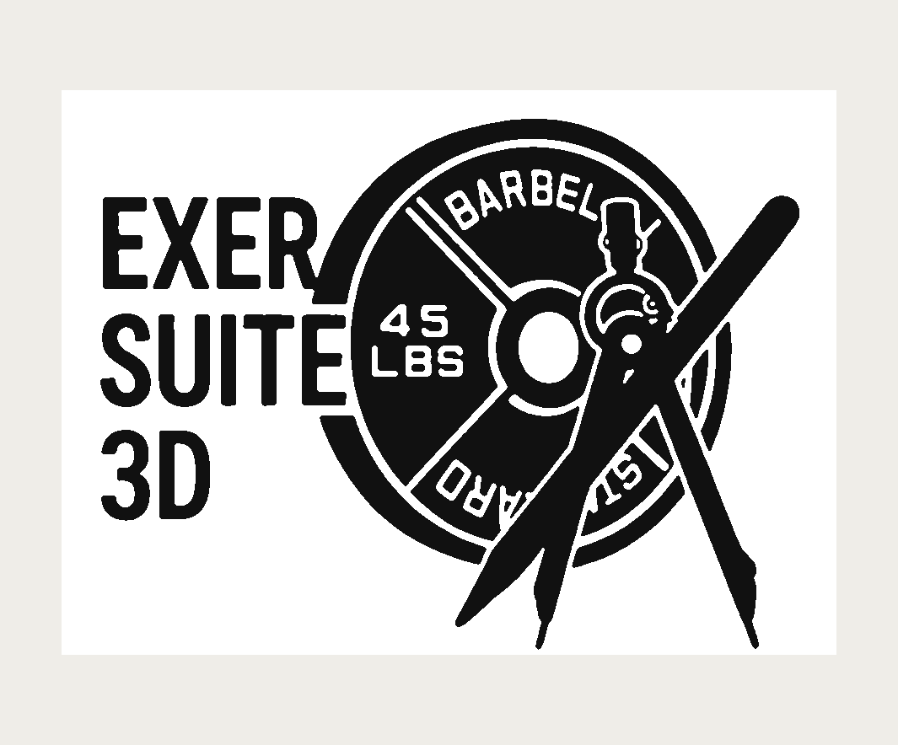

<p align="center">
  
</p>

# EXERSUITE3D

**Sitio del proyecto: <https://exersuite3d.vercel.app>** (español e inglés,
según la preferencia del navegador; también `/es` y `/en`). Ahí están la
presentación, las capturas y la descarga. El código de esa página vive en
[`sitio-web/`](sitio-web/) y su despliegue está documentado en
[`docs/DESPLIEGUE-TIENDA.md`](docs/DESPLIEGUE-TIENDA.md).

Plataforma de diseño 3D y simulación de físicas para **prototipar máquinas de
gimnasio**. Editor estilo SketchUp / NomadSculpt con medidas exactas en
centímetros, librería de componentes mecánicos y (próximamente) simulación de
palancas, poleas y pesos.

La identidad de marca (placa olímpica + compás de dibujo, monocroma) se integra
en la interfaz, el favicon y los iconos nativos. Los assets están en
[`public/brand/`](public/brand/) y se regeneran con
[`scripts/make-brand-assets.py`](scripts/make-brand-assets.py).

Objetivo multiplataforma desde un único código web:

- **Android (APK)** vía [Capacitor](https://capacitorjs.com/)
- **Windows (standalone)** vía [Tauri](https://tauri.app/) o Electron

## Stack

- **TypeScript** + **Vite**
- **[Three.js](https://threejs.org/)** para render 3D (1 unidad = 1 cm)
- **[Rapier](https://rapier.rs/)** (WASM) para simulación de física rígida

## Desarrollo

```bash
npm install
npm run dev        # servidor de desarrollo en http://localhost:5173
npm run build      # typecheck + bundle de producción en dist/
npm run preview    # sirve el build de producción
npm run typecheck  # solo comprobación de tipos
```

## Empaquetado (Android / Windows)

El mismo bundle web (`dist/`, con `base: "./"` para cargarse desde `file://`)
alimenta ambos empaquetados.

### Android — APK (Capacitor)

Requisitos: **Android Studio** + **Android SDK** y **JDK 17**. La configuración
está en [`capacitor.config.ts`](capacitor.config.ts) (`appId: com.exersuite.app`,
`webDir: dist`) y el proyecto nativo vive en [`android/`](android/).

```bash
npm run android:sync   # build web + copia a android/ y sincroniza plugins
npm run android:open   # abre Android Studio para compilar/firmar el APK
npm run android:apk    # alternativa CLI: genera app-debug.apk con Gradle
# (si clonas en limpio y falta android/: npm run android:add)
```

El APK de depuración queda en `android/app/build/outputs/apk/debug/`. Para una
APK/AAB de publicación, configura la firma en Android Studio (Build > Generate
Signed Bundle/APK).

### Windows — standalone (Tauri)

Requisitos: **Rust** (stable, target `x86_64-pc-windows-msvc`), **Microsoft C++
Build Tools** y **WebView2** (incluido en Windows 10/11). El crate de escritorio
está en [`src-tauri/`](src-tauri/) (`identifier: com.exersuite.app`).

```bash
npm run tauri:dev      # ejecuta la app de escritorio en modo desarrollo
npm run tauri:build    # genera el .exe + instaladores (NSIS / MSI) en
                       # src-tauri/target/release/bundle/
```

> El binario de Windows debe compilarse en Windows (o cruzado con el toolchain
> MSVC). En Linux, Tauri requiere además `webkit2gtk-4.1` para correr en local.

### Compilación automática (CI)

El workflow [`.github/workflows/build.yml`](.github/workflows/build.yml) compila
ambos binarios sin máquina local: el **APK** en un runner Linux con el Android
SDK y el **`.exe` + instaladores** en un runner Windows con Rust. Se dispara a
mano (*workflow_dispatch*), en cada push a la rama de trabajo y al publicar un
tag `v*`. Los binarios quedan como *artifacts* de la ejecución
(`exersuite3d-android-debug` y `exersuite3d-windows`).

**Publicación automática (Release):** al empujar un tag `v*` se ejecuta además
el job `release`, que adjunta el APK, el `.exe` y los instaladores NSIS/MSI a una
**GitHub Release** (con notas autogeneradas). Por ejemplo:

```bash
git tag v0.1.0
git push origin v0.1.0   # compila y publica la Release con los binarios
```

El historial de cambios versión a versión está en
[`CHANGELOG.md`](CHANGELOG.md). El ejecutable de Windows se publica como
`EXERSUITE3D.exe` (junto al instalador NSIS y el `.msi`).

### Migración a Godot (nativo)

La carpeta [`godot/`](godot/) contiene un **proyecto Godot 4 funcional** que
abre los mismos proyectos `.json` y los simula con física nativa (kit de
migración: piezas, articulaciones, cables, cuerdas, maniquí, mano interactiva
y cámara). La guía paso a paso — instalación, modelos `.glb`, exportar a
Windows/Android y hoja de ruta para completar el editor — está en
[`docs/MIGRACION-GODOT.md`](docs/MIGRACION-GODOT.md).

## Pantalla de inicio

Al abrir la aplicación se muestra una **landing ligera** que **no inicializa el
motor 3D** (WebGL/física) hasta que eliges una acción, para ahorrar recursos:

- **Crear nuevo proyecto** / **Abrir archivo…** (`.json`) / **Continuar sesión
  anterior** (autoguardado).
- **Explorar biblioteca**: vista de la Home que muestra solo el componente
  seleccionado en un **visor 3D** (sin cargar el entorno de diseño) para editar
  el repertorio de piezas con el mínimo de recursos.
- **Proyectos recientes**: lista de los proyectos abiertos o guardados
  (almacenados en IndexedDB del navegador).

Desde un proyecto, el botón **⌂ Home** vuelve a la pantalla de inicio (sugiriendo
guardar si hay cambios) y libera el editor, de modo que se puede trabajar en
varios proyectos de forma **secuencial** sin reiniciar la app. El botón
**Rendimiento** abre las opciones de calidad (presets Alto/Medio/Bajo, resolución
de render, sombras, reflejos y antialias) para diseñar con fluidez en equipos o
tablets con poca potencia.
- **Dedicatoria**: texto editable en [`public/dedicatoria.txt`](public/dedicatoria.txt)
  (se muestra tal cual; las líneas en blanco separan párrafos).

## Controles del editor

| Acción              | Atajo / interacción                     |
| ------------------- | --------------------------------------- |
| Orbitar cámara      | Arrastrar con el ratón / un dedo        |
| Pan / Zoom          | Click derecho-arrastrar / rueda / pinch |
| Seleccionar objeto  | Click sobre el objeto                   |
| Mover               | `W` o `G`                               |
| Rotar               | `E` o `R`                               |
| Escalar             | `S`                                     |
| Duplicar selección  | `Ctrl + D`                              |
| Eliminar selección  | `Supr` / `Backspace`                    |
| Deseleccionar       | `Esc`                                   |
| Simular / detener   | `Espacio` o botón **Simular**. Al simular se oculta la UI de edición y aparece la **barra de simulación** |
| Modo Simulador      | Pantalla de inicio → selector **▶ Simulador**: abre un proyecto solo para correr su física (sin herramientas de edición) |
| Herramientas de simulación | Barra inferior: **perspectivas** (Frontal/Lateral/Superior/Isométrica), **zoom** ＋/－, arrastrar el **maniquí** para situarlo, y **mano interactiva**: arrastra una pieza móvil y un resorte físico tira de ella (como una persona usando agarres y barras) |
| Guardar / cargar    | Botones **Guardar** / **Cargar** (proyecto a archivo `.json`) |
| Nuevo proyecto      | Botón **Nuevo**: vacía la escena y descarta el autoguardado |
| Autoguardado        | Automático en el navegador (localStorage); se restaura al reabrir. Indicador **Guardado ✓** en la barra |
| Biblioteca de modelos | Botón **Biblioteca**: sustituye la primitiva de cualquier componente por un modelo 3D (.glb/.gltf/.obj) de SketchUp/Nomad; se aplica a todas sus piezas y persiste en el navegador |
| Exportar / importar | Botones **Exportar** (.glb) / **Importar** (.glb/.gltf/.obj) para intercambiar modelos 3D |
| Crear articulación  | **+ Bisagra** / **+ Corredera**, luego clic en pieza A y pieza B |
| Trazar cable        | **+ Cable** → **línea recta** entre dos anclas: clic en el 1.er anclaje y en el 2.º (se ajusta al **punto de conexión** más cercano, con previsualización). Para reenviar, clic en una **roldana/polea** antes del 2.º anclaje (solo esas superficies deslizan); **Enter/Finalizar** cierra un cable con reenvíos |
| Cadena/correa de seguridad | Clic en la pieza de la paleta → **línea**: clic en el extremo de inicio y en el final (se anclan a piezas/superficie). Cuelgan en catenaria; ajusta la **tensión** en Conexiones. Sus segmentos (eslabón/listón) se reemplazan desde la biblioteca |
| Pilar / travesaño (línea) | Paleta → **Pilar / travesaño (línea)**: elige **perfil 1:1/1:2/1:3**, medida nominal, **extremos** (plano/diagonal) y **pinholes** (⌀ y distancia) → clic en inicio y fin, como la línea recta de Paint. **Aim assist**: imán a extremos/nodos/puntos medios de otras piezas. Encadena varias; **ESC** para salir |
| Tubo de acero (línea) | Paleta → **Tubo de acero (línea)**: elige el **⌀ nominal** → clic en inicio y fin, con el mismo aim assist |
| Doblar por nodos (bending) | Selecciona un pilar/travesaño o tubo → Inspector → **✎ Doblar (nodos)**: arrastra los nodos de la trayectoria para dar forma (curva suave estilo Photoshop). Clic fuera o **ESC** para terminar |
| Encaje magnético    | Botón **Imán**: al mover una pieza, encaja en puntos de anclaje (centro/extremos/caras) de otras |
| Agrupar piezas      | **Shift+clic** para multiseleccionar → **Agrupar**; grupo: **nombrar/duplicar/desagrupar/eliminar** en el inspector |
| Voltear (espejo)    | Inspector → **Voltear X/Y/Z** sobre la pieza seleccionada |
| Modelado avanzado   | Inspector → **Doblar °**, **Torcer °** (todas) y **Bisel cm** (cajas) |
| Ángulo de articulación | Selecciona un miembro del maniquí → campos **X/Y/Z (grados)** en el panel Posturas |
| Figura humana       | Botón **Figura**; tipo **Maniquí / Esqueleto** y altura en cm |
| Segmentos del maniquí | Biblioteca (Home) → pestaña **Maniquí**: sustituye cada parte del cuerpo por un modelo 3D (se ajusta al hueco de la parte) |
| Posar figura        | Clic en un miembro del maniquí → arrastrar el eje articular gira el segmento en torno a la articulación, solo en sus **ejes naturales** y dentro de rangos anatómicos |
| Editar/crear postura | Posa a mano y **Actualizar** (sobrescribe) o **Guardar como…** (nueva); editables y persistentes |
| Apoyar mano (IK)    | Panel Posturas → **Apoyar mano** → clic en una mano y luego en un agarre; la mano se fija y lo sigue |

## Arquitectura

```
src/
  core/        # unidades (cm), bus de eventos, Editor (orquestador + simulación), snapping
  scene/       # SceneManager: escena, cámara, luces, grid en cm, entorno PBR
  objects/     # SceneObject, geometrías, librería de componentes, materiales, figura humana
  physics/     # PhysicsWorld (Rapier), joints (bisagra/corredera) y cables
  ui/          # paleta, toolbar, inspector, conexiones, HUD de medidas
  main.ts      # punto de entrada y ensamblado
```

## Assets de terceros y licencias

El esqueleto humano de referencia (`public/models/overview-skeleton.glb`) es una
conversión del modelo **Open3DModel** de O. Paul Gobée y col. (Dept. de Anatomía,
LUMC; vía caskanatomy.info / AnatomyTOOL), bajo **Creative Commons
Attribution-ShareAlike (CC BY-SA)**. La app muestra el crédito al activar el
esqueleto. Detalles en [`public/models/ATTRIBUTION.md`](public/models/ATTRIBUTION.md).
La cláusula ShareAlike aplica al modelo y sus derivados (la malla), no al resto
del código de EXERSUITE3D.

## Convención de unidades

`1 unidad de mundo de Three.js = 1 cm`. La rejilla usa celdas de 10 cm con
divisiones mayores cada metro. Todas las dimensiones del inspector se editan y
muestran en centímetros.

## Librería de componentes

Agrupada por categoría: **estructural** (pilares, bases, soportes, montante de
rack, brazos/correas de seguridad, barras de dominadas y fondos, landmine),
**movimiento** (guías, rieles, fulcros, pivotes, pop-pin, carro de cable),
**transmisión** (poleas, roldanas, engranajes, cables, cadenas, listones de
Kevlar, resortes, leva de resistencia variable), **peso** (bloques, discos,
contrapesos, barra olímpica, pila de pesos, cuerno de carga, micro-disco) y
**ergonómico** (agarraderas, asientos, respaldos, D-handle, cuerda de tríceps,
barra de jalón, correa de tobillo). Cada componente lleva un material PBR y
atributos físicos editables (masa en kg, anclaje).

Cada componente se dibuja por defecto con una primitiva paramétrica, pero desde
la **Biblioteca** (botón en la barra) puedes sustituir esa primitiva por un
modelo 3D detallado diseñado en **SketchUp** o **Nomad** (`.glb`, `.gltf` u
`.obj`): el modelo se fusiona, se escala a cm (heurística metros→cm), se centra y
se aplica a **todas** las instancias de ese componente (presentes y futuras). El
modelo se guarda en el navegador (**IndexedDB**) y se restaura al reabrir; con
**Restablecer** se vuelve a la primitiva.

Para ajustes **sin usar la app ni código**, también puedes reemplazar modelos por
fichero: coloca tu `.glb/.gltf/.obj` en
[`public/models/components/`](public/models/components/) y anótalo en su
`manifest.json` (id de componente → nombre de fichero). Se cargan al arrancar;
los modelos puestos desde la Biblioteca tienen prioridad. Ver
[`public/models/components/LEEME.md`](public/models/components/LEEME.md).

Para **mantener el repertorio entre dispositivos**, la biblioteca (en la Home)
permite **Exportar ZIP** (todos los modelos con su fecha) e **Importar ZIP**: al
importar, un diálogo compara cada modelo entrante con el local y lo clasifica
(nuevo / más reciente / más antiguo / sin cambios); por defecto aplica los nuevos
y los más recientes y no sobrescribe tus ediciones con versiones más antiguas.

El diseño de los componentes, mecanismos, paletas de color y cinemática se
documenta en [`docs/REFERENCIAS.md`](docs/REFERENCIAS.md), una síntesis de
referencias de REP, Rogue, Titan, Hammer Strength, Cybex y Obelix.

## Hoja de ruta

- [x] **Fase 1 — Base del editor**: viewport 3D, cámara orbital, grid en cm,
      selección, gizmos mover/rotar/escalar, librería de componentes, inspector
      con medidas exactas, HUD de medidas.
- [~] **Fase 2 — Física**: integración de Rapier ✔ (cuerpos rígidos, gravedad,
      masas, colisiones, Play/Stop con restauración del diseño). Articulaciones ✔
      — bisagra (revolute) y corredera (prismatic) con eje, pivote, límites de
      recorrido y motor de velocidad. Cables y poleas ✔ — cable inextensible que
      pasa por poleas (puntos de paso) y acopla sus dos extremos por conservación
      de longitud (p. ej. agarradera ↔ pila de pesos). Pendiente: poleas móviles
      (ratio 2:1), motores de posición, leva de resistencia variable.
- [~] **Fase 3 — Modelado/ensamblaje**: snapping de ensamblaje ✔ (encaje
      magnético en puntos de anclaje: centro/eje, extremos de cilindros, centros
      de cara). Estilo visual ilustrativo ✔ (fondo claro de estudio, iluminación
      suave, figura azul, sombras tenues). Agrupación multicomponente ✔
      (subensamblajes: multiselección con Shift, mover/eliminar el grupo junto,
      desagrupar). Modelado ✔ — voltear (espejo) y deformación libre: doblar
      (bend), torcer (twist) y biselar/redondear aristas (cajas).
      Personaje posable ✔ (maniquí con rig de 12
      articulaciones rotables, apoyado en el suelo). Posturas estándar **editables
      y ampliables** ✔ (biblioteca persistente: aplicar, actualizar, guardar
      nuevas, eliminar, restaurar por defecto).
- [x] **Figura humana de referencia**: maniquí procedural **o** esqueleto
      anatómico detallado (glTF/Draco), a escala con altura editable en cm, para
      diseñar máquinas en torno al cuerpo.
- [x] **Guardar/cargar proyecto**: serializa toda la escena (piezas, joints,
      cables, grupos y personaje con su pose) a un archivo `.json` y la reconstruye.
      Además, **autoguardado** en el navegador (localStorage): los cambios se
      vuelcan de forma diferida y se restauran al reabrir la app.
- [~] **Fase 4 — Interoperabilidad**: exportar el prototipo a glTF binario ✔
      (`.glb`, con materiales) e importar modelos externos ✔ (`.glb`/`.gltf` con
      Draco u `.obj`): la malla se fusiona en una sola pieza, se aplica una
      heurística metros→cm y el objeto importado se centra y apoya en el suelo
      (no es paramétrico y no se reserializa al guardar el proyecto). Pendiente:
      preservar la jerarquía multicomponente al importar.
- [~] **Fase 5 — Empaquetado**: configuración lista para ambos destinos. Android
      con **Capacitor** (`capacitor.config.ts` + proyecto nativo en `android/`,
      scripts `android:sync/open/apk`) y Windows con **Tauri** (`src-tauri/` con
      `tauri.conf.json` y crate Rust, scripts `tauri:dev/build`). La compilación
      final del APK/`.exe` se hace en un host con Android SDK / toolchain de
      Windows; ver «Empaquetado» arriba.
